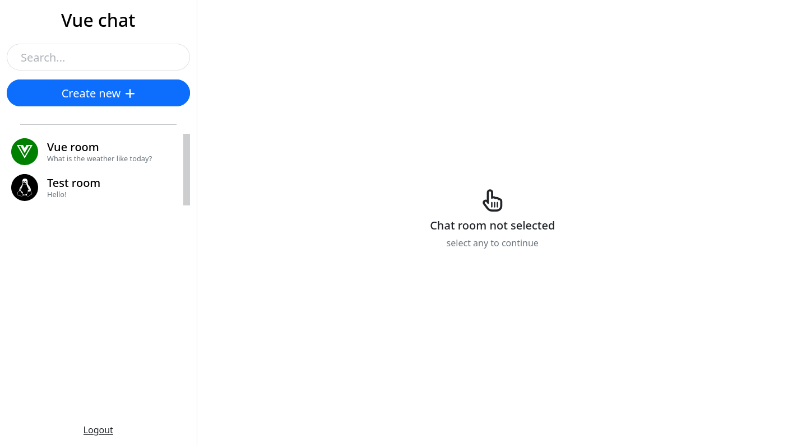
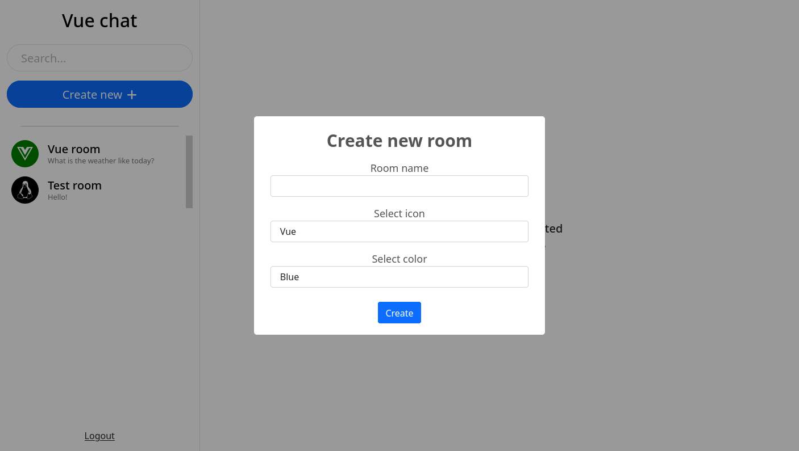
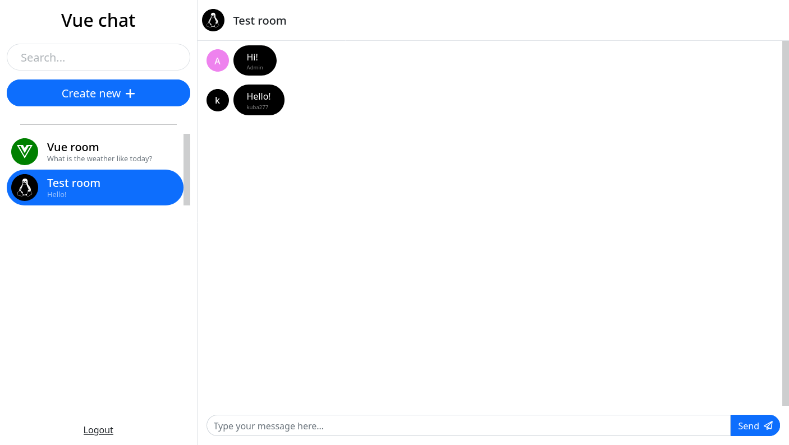
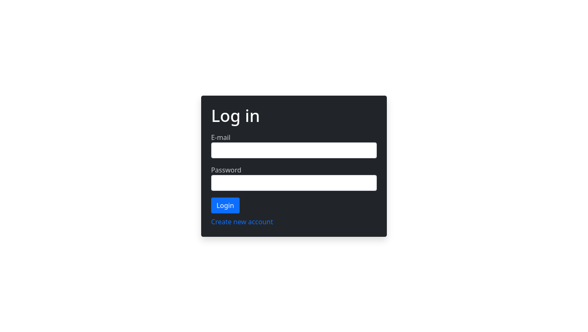

# Vue Chat 2 - Chat rooms in vue 🗣️

## What is Vue Chat 2?

Vue chat is a simple messenger where you can communicate via rooms.

You can log in using your e-mail and password. Authentication is handled by Firebase.

All messages are stored in the Firebase Realtime Database.

[Give it a try!](https://jeboczek.github.io/Vue-Chat-2/)

## Screen shots

